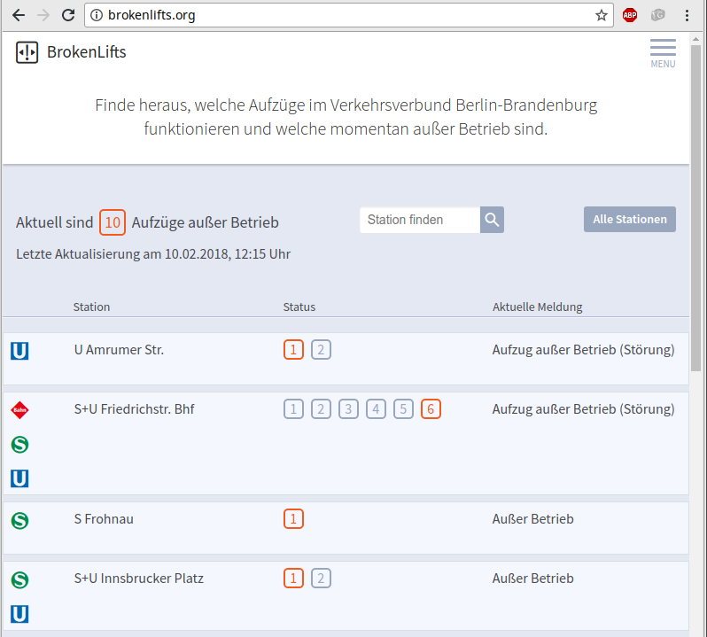

@title[Start]

## OpenMetroMaps

#### Free schematic maps for transit networks

---

@title[Einleitung]

* Dateiformat
* Software
* Bibliotheken

---

@title[Berliner Linien]

## Berliner Linien
Michael Frenzel

<http://daten.berlin.de/anwendungen/berliner-linien>
<https://www.berliner-linien.de>

---

@title[Berliner Linien]

---

@title[Berliner Linien]

---

@title[Berliner Linien]

---?image=http://www.wimdu.de/blog/wp-content/uploads/2015/12/BerlinClubs-UBahn-map-DE-2.jpg&size=contain

---?image=assets/images/mitvergnuegen-icecream.png&size=contain

---?image=https://mitvergnuegen.com/wp-content/uploads/2016/06/bvg-mvg-1600x1360px-hipster-29-juni-web-titel.png&size=contain

---?image=https://www.immobilienscout24.de/content/dam/is24/ibw/dokumente/miet-map-berlin.jpg&size=contain

---?image=assets/images/berlin-english.png&size=contain

---

@title[BrokenLifts]

