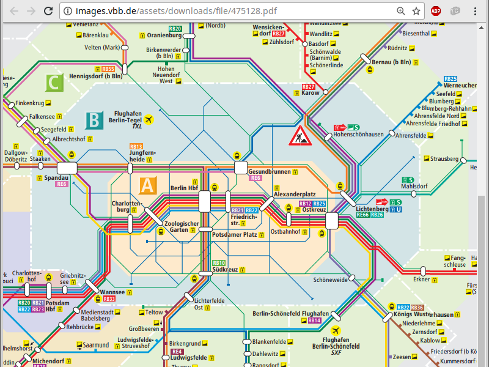

@title[Start]

## Open<span class="gold">Metro</span>Maps

#### Freie schematische Karten für den ÖPNV

### Ideenwerkstatt

---

@title[Ablauf]

### <span class="gold">Ablauf</span>

#### Impulsvortrag
#### Vorstellungsrunde
#### Sammeln von Ideen
#### Diskussion

Note:
* Votrag ca. halbe Stunde
* Übersicht, coole Ideen
---

@title[OpenMetroMaps]

### <span class="gold">OpenMetroMaps</span>

#### Motivation
#### Überblick
#### Stand
#### Ausblick

---
<!-- Karten der Verkehrsbetriebe -->

@title[BVG S+U]


---

@title[BVG Tram]


---

@title[VBB]



---
<!-- OSM -->

@title[OSM]


---

@title[ÖPNV-Karte]


---
<!-- OMM -->

@title[Übersicht]

### <span class="gold">OpenMetroMaps</span>

* Dateiformat
* Anwendungen
* Software-Bibliotheken
* Daten für Städte / Regionen

---

```xml
<omm-file version="1.0.0">
  ...
</omm-file>
```
---

```xml
<stations>
  <station lat="52.521515" lon="13.412305" name="Alexanderplatz"/>
  <station lat="52.520387" lon="13.386885" name="Friedrichstraße"/>
  <station lat="52.522648" lon="13.402209" name="Hackescher Markt"/>
</stations>
```

---

```xml
<lines>
  <line circular="false" color="#006CB3" name="S3">
    <stop station="Alexanderplatz"/>
    <stop station="Hackescher Markt"/>
    <stop station="Friedrichstraße"/>
  </line>
</lines>
```

---

```xml
<view name="Berlin" scene-height="904.137943" scene-width="1000.000000"
      start-x="386.178629" start-y="478.710910">
  ...
</view>
```

---

```xml
<station name="Alexanderplatz" x="424.775181" y="461.793637"/>
<station name="Friedrichstraße" x="392.200080" y="459.965281"/>
<station name="Hackescher Markt" x="408.133553" y="459.451927"/>
```

---

```xml
<edges line="S3"/>
<edges line="S45">
  <interval from="Adlershof" to="Flughafen Berlin-Schönefeld"/>
</edges>
```

---?image=assets/images/omm-editor2.png&size=contain

---?image=assets/images/omm-editor1.png&size=contain

---

### <span class="gold">Plattformen / Bibliotheken</span>
#### Desktop: AWT/Swing
#### Mobile: Android
#### Browser: GWT
#### Export in Bildformate (Raster / Vektor)

---?image=assets/images/omm-data.png&size=contain

---
<!-- Interaktive Anwendungen -->
@title[Berliner Linien]

### Berliner Linien
Michael Frenzel

<http://daten.berlin.de/anwendungen/berliner-linien>
<https://www.berliner-linien.de>

---

@title[Berliner Linien]


---

@title[Berliner Linien]


---

@title[Berliner Linien]


---

@title[BVG interaktiv]


---?image=assets/images/brokenlifts.png&size=contain

@title[BrokenLifts]

<!-- Modifizierte Karten -->
---?image=assets/images/berlin-english.png&size=contain

@title[S+U Englisch]

---?image=http://www.wimdu.de/blog/wp-content/uploads/2015/12/BerlinClubs-UBahn-map-DE-2.jpg&size=contain

@title[Clubs]

---?image=assets/images/mitvergnuegen-icecream.png&size=contain

@title[MV Eisläden]

---?image=https://mitvergnuegen.com/wp-content/uploads/2016/06/bvg-mvg-1600x1360px-hipster-29-juni-web-titel.png&size=contain

@title[MV Hipster]

---?image=https://www.immobilienscout24.de/content/dam/is24/ibw/dokumente/miet-map-berlin.jpg&size=contain

@title[Mietpreise]

<!-- Wikipedia -->

---?image=assets/images/wikipedia-suedkreuz1.png&size=contain

@title[Wikipedia: Südkreuz]

---?image=assets/images/wikipedia-suedkreuz2.png&size=contain

@title[Wikipedia: Südkreuz]

---?image=assets/images/wikipedia-suedkreuz3.png&size=contain

@title[Wikipedia: Südkreuz]

---?image=assets/images/wikipedia-suedkreuz4.png&size=contain

@title[Wikipedia: Südkreuz]

---?image=assets/images/wikipedia-suedkreuz5.png&size=contain

@title[Wikipedia: Südkreuz]

---?image=assets/images/wikipedia-vorlage-spnv.png&size=contain

@title[Wikipedia: Vorlage SPNV]

<!-- Wikidata -->

@title[Wikidata: Südkreuz]

---?image=assets/images/wikidata-suedkreuz1.png&size=contain

@title[Wikidata: Südkreuz]

---?image=assets/images/wikidata-suedkreuz2.png&size=contain

@title[Wikidata: Südkreuz]

---?image=assets/images/wikidata-suedkreuz3.png&size=contain

@title[Wikidata: Südkreuz]

---?image=assets/images/wikidata-suedkreuz4.png&size=contain

@title[Wikidata: Südkreuz]

---?image=assets/images/wikidata-suedkreuz5.png&size=contain

@title[Wikidata: Südkreuz]

---?image=assets/images/junglebus1.png&size=contain

@title[Jungle Bus]

---?image=assets/images/db-ice.png&size=contain

@title[DB: ICE-Netz]

---
@title[Zusammenfassung]

### <span class="gold">Zusammenfassung</span>

#### Interaktive Anwendungen
#### Veränderte thematische Karten
#### Datenpflege in OSM, Wikipedia, Wikidata
#### Neue/bessere Karten erstellen
